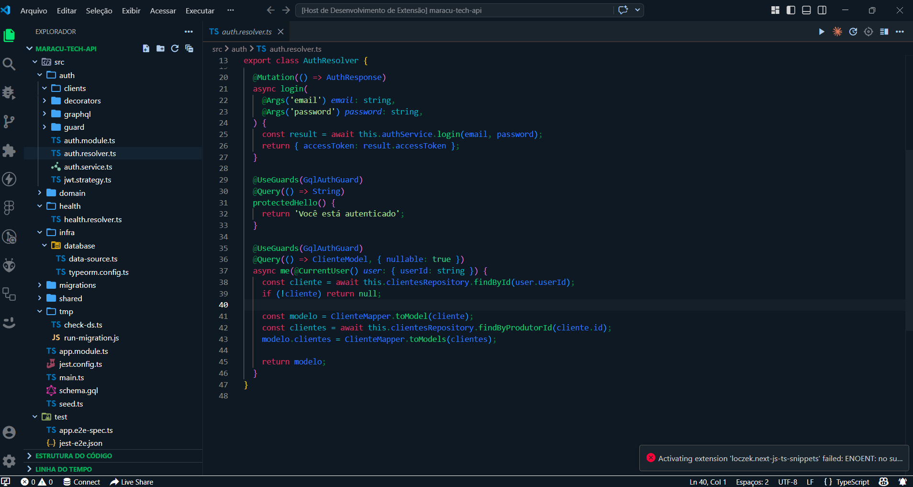

# StarCap Dark Theme

 

Tema escuro profissional para Visual Studio Code, inspirado na identidade visual StarCap. Oferece sintaxe com alto contraste e acentos neon para melhorar a legibilidade e reduzir a fadiga visual durante longas sessões de desenvolvimento.

## 📸 Preview

>

## ✨ Principais características

- Paleta escura com contrastes otimizados
- Cores neon para destacar keywords, strings e chamadas de função
- Suporte a linguagens populares: JavaScript, TypeScript, React, HTML, CSS e mais
- Decorações Git e terminal com esquema coerente
- Fácil personalização via arquivo de tema

## 🚀 Instalação

### Instalação pelo Marketplace (recomendado)

1. Abra o Visual Studio Code
2. Pesquise por "StarCap Dark" no Marketplace
3. Clique em "Instalar" e selecione o tema nas Preferências → Tema de Cor

> Caso o pacote ainda não esteja publicado, use a instalação manual abaixo.

### Instalação manual

1. Clone este repositório:

```bash
git clone https://github.com/StarCapGroup/starcap-theme.git
```

2. Copie a pasta do tema para a pasta de extensões do VS Code:

- macOS / Linux: `~/.vscode/extensions/`
- Windows: `%USERPROFILE%\\.vscode\\extensions\\`

3. Recarregue o VS Code: `Developer: Reload Window`
4. Selecione o tema: `Preferences: Color Theme` → `StarCap Dark`

## 🛠️ Customização

- Arquivo de tema principal: `themes/StarCap Theme Dark-color-theme.json`
- Para ajustar cores, edite o arquivo acima e recarregue o VS Code.
- Sugestão: mantenha um branch de desenvolvimento para mudanças e use PRs para revisão.

## ✅ Boas práticas de uso

- Use o tema em monitores com correção de cor para melhores resultados
- Combine com fontes de alta legibilidade (ex.: Fira Code, JetBrains Mono)
- Ajuste o brilho do terminal para evitar reflexos excessivos

## 🧩 Contribuindo

Contribuições são bem-vindas. Para contribuir:

1. Fork o repositório
2. Crie uma branch com a sua feature: `git checkout -b feat/minha-melhoria`
3. Faça commits pequenos e claros
4. Abra um Pull Request descrevendo a mudança

Por favor, abra issues para bugs ou sugestões de melhoria.

## 📜 Changelog (resumo)

- 1.0.0 — Lançamento inicial com a paleta StarCap e suporte para principais linguagens

## 📄 Licença

MIT © StarCap

## 🔗 Links úteis

- Website: https://starcap.com.br
- VS Code Theme docs: https://code.visualstudio.com/api/extension-guides/color-theme

---


Feito com ❤️ pela equipe StarCap